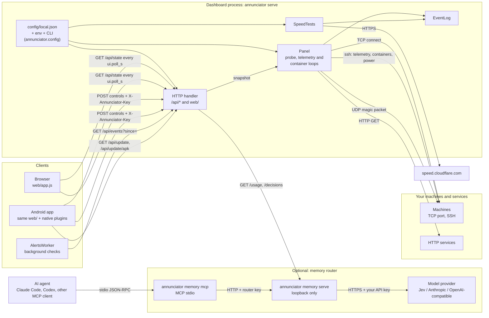

# Architecture

Annunciator is one Python process (the dashboard), an optional second process
(the memory router), a static web client that both browsers and the Android
app run, and a few setup tools. The Python code uses only the standard library.

## Components and data flow

## The dashboard process

`annunciator serve` loads and validates the configuration
(`annunciator.config`), builds an `App` (`annunciator/server/app.py`) and
starts four daemon threads plus the HTTP server:

| Thread | Loop | Writes |
| --- | --- | --- |
| `probe-loop` | Every `interval_s`: TCP connect to each machine, HTTP GET to each service, in a pool of `probe.workers`. | `Track` histories, offline/recovery events |
| `telemetry` | Every `telemetry.interval_s`: one collection per machine with `telemetry` set, skipped while offline. | latest readings, CPU/network series, resource events |
| `containers` | Every `container_poll.interval_s`: `docker`/`podman ps` per machine with `containers` set. | inventories, stopped-container events |
| `speedtest` | Every `speedtest.interval_h` (only when routes exist), or when requested. | `<data_dir>/speedtest.json`, failure events |

All shared state lives in `Panel`, guarded by one lock. The HTTP handler never
probes anything itself: `GET /api/state` returns `Panel.snapshot()`, a
consistent copy of the latest readings, recent events, branding, thresholds and
client settings. Controls (`POST`) check `allow_controls` and the control key,
then call into `Panel` or `remote.power`.

Availability history, telemetry series and events live in memory and reset on
restart. Speed-test results, keys and the router's decision log are files in
the data folder.

## The web client

`web/` is plain HTML, CSS and JavaScript with no build step. `app.js` polls
`/api/state` (every `ui.poll_s`, default 5 s), renders Overview, Systems, host
and service details, Log, Setup and Settings, and sends controls with the key
stored in that device's local storage. `sw.js` caches the shell for offline
start-up but never caches `/api/`; the server stamps the release version into
it so a new release retires the old cache. `guide.html` is generated from
these docs ([Tools](tools.md#build_docspy)).

## The Android app

A Capacitor wrapper (`android/`) around the same `web/` folder, plus three
Java classes: `MainActivity` (Back handling), `UpdaterPlugin` (version, alert
settings, APK install) and `AlertsWorker` (background event checks). See
[Android](android.md).

## The memory router

An optional, separate process bound to loopback. An agent calls the MCP
server (`annunciator memory mcp`), which forwards each tool call to the router
over HTTP with the router access key. For `memory_route`, the router sends the
fact and its routing questions to the configured model provider, validates the
typed answer, and returns a suggestion; it logs the decision but never the fact.
Write leases are held in memory. The router never writes memory files; the
agent does. See [AI agents and models](ai-agents.md).

## Setup and maintenance tools

`annunciator setup` writes the configuration and local scripts; `doctor`
checks an installation; `tools/audit_public.py`, `tools/package_public.py`,
`tools/build_docs.py` and `tools/ui_preview.py` support maintainers. See
[Tools](tools.md) and the [module reference](modules.md).

## Design choices

- **Standard library only** at runtime, so a friend can run it from a ZIP with
  the Python their distribution ships.
- **No accounts.** Read endpoints are open to whoever can reach the listener;
  writes need a key. Put the dashboard behind a trusted network or an
  authenticating reverse proxy ([Security](security.md)).
- **No agents on targets.** Telemetry is a script sent over SSH each time.
- **Nothing preset.** The source has no addresses, accounts or keys; the wizard
  asks for them and writes them to ignored files.
- **One schema** declares every configuration key; validation, JSON Schema,
  the full example and the reference tables all come from it.
